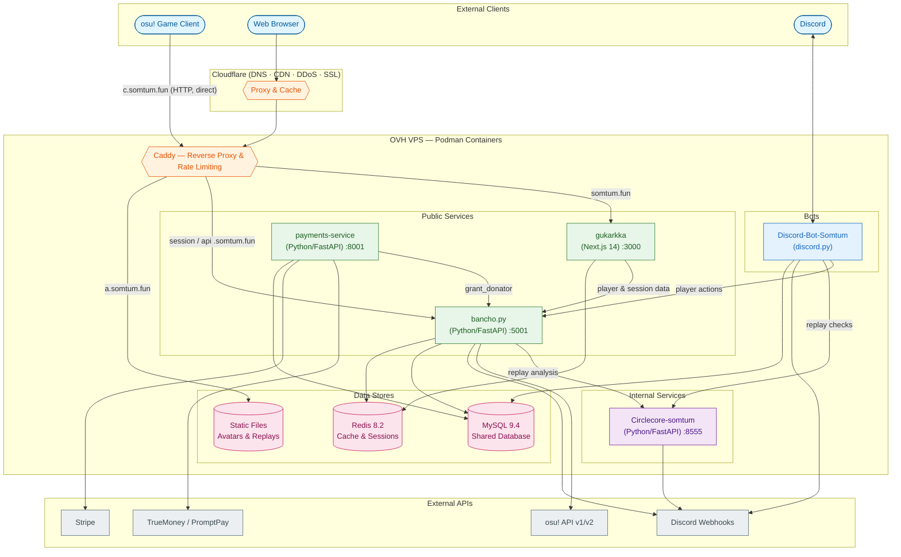

  

# osu!somtum

osu!somtum is an [osu!](https://osu.ppy.sh) private server from Thailand. Services communicate via a shared MySQL database and Redis cache, all hosted on OVH and fronted by Cloudflare.

**Website:** [somtum.fun](https://somtum.fun)

## Service Architecture

## Services

| Service | Language | Purpose |
|---|---|---|
| **bancho.py** | Python/FastAPI | Core game server (osu! protocol, scoring, multiplayer) |
| **gukarkka** | Next.js 14/TypeScript | Web frontend — profiles, leaderboards, beatmap browser |
| **Discord-Bot-Somtum** | Python/discord.py | Community bot — stats, moderation, beatmap workflow |
| **Circlecore-somtum** | Python/FastAPI | Anti-cheat — replay analysis & similarity detection |
| **payments-service** | Python/FastAPI | Donation processing (TrueMoney, PromptPay, Stripe) |

## Communication Patterns

- **Shared Database**: bancho.py, Discord bot, and payments-service all connect to the same MySQL instance
- **Redis**: bancho.py for sessions and cache; gukarkka for caching
- **HTTP REST**: All inter-service communication

### Inter-Service HTTP Calls

| Caller | Target | Purpose |
|---|---|---|
| gukarkka | bancho.py | Player sessions, scores, leaderboards |
| bancho.py | Circlecore-somtum | Queue replay for analysis after score submit |
| payments-service | bancho.py | `POST /internal/grant_donator` — sync donator status |
| Discord-Bot-Somtum | bancho.py | Player management (restrict, whitelist, etc.) |
| Discord-Bot-Somtum | Circlecore-somtum | On-demand replay checks from staff commands |

### Score Submission Flow

1. Client `POST`s encrypted score data to bancho.py via `c.somtum.fun`
2. bancho.py decrypts and validates the score
3. Score and stats written to MySQL
4. Replay queued to Circlecore-somtum for async analysis
5. Circlecore fires Discord webhook alert if suspicious
6. First-place announcements sent via Discord webhook

## Tech Stack

| Category | Technologies |
|---|---|
| **Languages** | Python, TypeScript, SQL |
| **Web Frameworks** | FastAPI, Next.js 14, React 18 |
| **Databases** | MySQL 9.4, Redis 8.2 |
| **Styling** | Tailwind CSS, shadcn/ui |
| **Discord** | discord.py 2.4+ |
| **Anti-cheat** | circleguard 5.4.3 |
| **Containers** | Podman / Podman Compose |
| **Reverse Proxy** | Caddy |
| **External APIs** | osu! API v1/v2, Discord, TrueMoney, PromptPay, Stripe |

## Infrastructure

| Provider | Purpose |
|---|---|
| **OVH** | VPS — hosts all services |
| **Cloudflare** | DNS, CDN, DDoS protection, SSL certificates |
| **Caddy** | Reverse proxy, automatic HTTPS, rate limiting |
| **Podman** | Container runtime & orchestration |

### Domain Routing

| Domain | Service | Notes |
|---|---|---|
| `somtum.fun` | gukarkka :3000 | Behind Cloudflare proxy |
| `session.somtum.fun` / `api.somtum.fun` | bancho.py :5001 | Behind Cloudflare proxy |
| `c.somtum.fun` | bancho.py :5001 | **Direct** — osu! client does not support Cloudflare proxy |
| `a.somtum.fun` / `assets.somtum.fun` | Static files | Avatars, replays |
